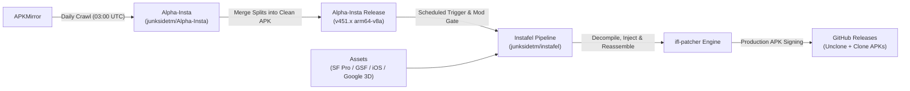

<h1 align="center">Instafel 🚀</h1>

  <b>Advanced Instagram Alpha Customization Suite & Typography Engine</b> 
  <i>Seamlessly injecting multi-weight Apple San Francisco / Google Sans Flex typography, iOS 26.4 / Google 3D emojis, AMOLED styling, and developer tools into Instagram Alpha releases.</i>

  
  
  
  
  

---

## 🌟 Highlights & New Features

### 1. 🔤 Hierarchical Typography Engine
Instafel dynamically replaces standard fonts across all UI elements with calibrated font weight hierarchies:
- **Apple San Francisco (`SF Pro`)**:
  - **Display Bold & Black**: Headlines, profile handles, and screen titles.
  - **Text Regular & Medium**: Body copy, comments, captions, and DM threads.
  - **Italic**: Calibrated slant for secondary captions and timestamps.
- **Google Sans Flex (Variable Font)**:
  - **Variable Axes Integration**:
    - Optical Sizing (`opsz`): `ON`
    - Width (`wdth`): `97.5`
    - Roundness (`ROND`): `73`
    - Contextual Weights: Dynamic `300` to `800` mapping
    - Italic Slant (`slnt`): `-10`

### 2. 🎨 Custom Emoji Suites
- **Apple iOS Emojis (iOS 26.4)**: Render authentic Apple emojis across direct messages, comments, reels, and stories.
- **Google 3D Emojis**: Crisp, modern fluent/3D vector emoji glyphs sourced directly from [junksidetm/Google-Emoji-3D](https://github.com/junksidetm/Google-Emoji-3D).

### 3. ⚙️ Dedicated Instafel Settings Menu
Access all mod settings directly inside the app under **Instafel Settings → Typography & Emojis**:
- Real-time switch for Custom Font Hierarchy
- Font Family Picker (Apple SF Pro vs. Google Sans Flex vs. Default)
- Live Typography Hierarchy Preview card
- Real-time switch for Custom Emojis
- Emoji Pack Picker (Apple iOS 26.4 vs. Google 3D vs. System Default)
- Live Emoji Glyph Preview card

### 4. 🛡️ Core Patch Suite
- **Developer Options**: Unlocks internal Instagram experiment flags and developer tools.
- **Ad Removal**: Filters sponsored posts, story advertisements, and suggested clips.
- **AMOLED Pure Black**: Forces dark surfaces to deep `#000000` for OLED battery savings.
- **Snooze Warning Bypass**: Silences timeout and snooze alerts.
- **Clone Variant**: Standalone package identifier enabling side-by-side installation with official Instagram.
- **Channel Customization**: Personalized build and channel naming.

---

## 🏗️ System Architecture

Instafel employs a decoupled, 100% autonomous online build pipeline:

1. **Upstream Ingest ([Alpha-Insta](https://github.com/junksidetm/Alpha-Insta))**:
   - Monitored daily at `03:00 UTC` for new Instagram Alpha releases.
   - Bypasses Cloudflare anti-bot verification via authentic `APKUpdater-v0` token headers.
   - Extracts APKM bundles and merges multi-APK splits into a clean standalone base APK using `APKEditor`.
2. **Downstream Modding ([Instafel](https://github.com/junksidetm/instafel))**:
   - Gated check: Checks `Alpha-Insta` releases against already modded versions. If no new Alpha was published that day, the workflow terminates within 5 seconds to conserve resources.
   - Downloads the pre-merged standalone APK directly from `Alpha-Insta`.
   - Injects custom fonts and emoji smali hooks.
   - Rebuilds and production-signs both **Unclone** and **Clone** APK variants.
   - Publishes official releases directly on GitHub Releases.

---

## 📦 Production Deliverables

Every release on [GitHub Releases](https://github.com/junksidetm/instafel/releases) provides:

| Deliverable | Package Target | Description |
|---|---|---|
| `instafel-v<VERSION>-arm64-v8a-unclone.apk` | `com.instagram.android` | Unclone variant. Directly replaces official Instagram. |
| `instafel-v<VERSION>-arm64-v8a-clone.apk` | `com.instafel.android` | Standalone clone variant. Installs alongside official Instagram. |
| `build_info.json` | Metadata | Cryptographic MD5 hashes, commit IDs, and generation timestamps. |

---

## 🌐 Multi-Platform Mirror Ecosystem

Following our decentralized multi-platform policy, Instafel maintains active functional parity across all official hosts:

- **GitHub (Primary)**: [`https://github.com/junksidetm/instafel`](https://github.com/junksidetm/instafel)
- **GitLab (Mirror)**: [`https://gitlab.com/mrdarksidetm/instafel`](https://gitlab.com/mrdarksidetm/instafel)
- **Codeberg (Mirror)**: [`https://codeberg.org/mrdarksidetm/instafel`](https://codeberg.org/mrdarksidetm/instafel)

Every commit across all three mirrors is cryptographically signed with verified SSH keys:
- GitHub: `junksidetm` (`331540275+junksidetm@users.noreply.github.com`)
- GitLab / Codeberg: `mrdarksidetm` (`ajukr99901@gmail.com`)

---

## ⚠️ Disclaimer

Instafel is **not affiliated with, maintained by, or endorsed by Meta or Instagram**. This project is open-source and intended solely for personal educational and research purposes. Commercial distribution or unauthorized resale is strictly prohibited.

---

  <i>Forked and extended with ❤️ by <a href="https://github.com/junksidetm">junksidetm</a></i> 
  <i>Original base created by <a href="https://github.com/mamiiblt">mamiiblt</a></i>

